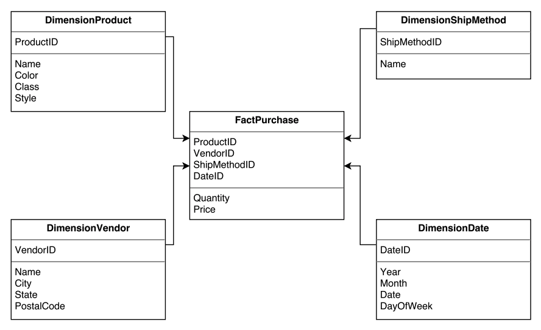
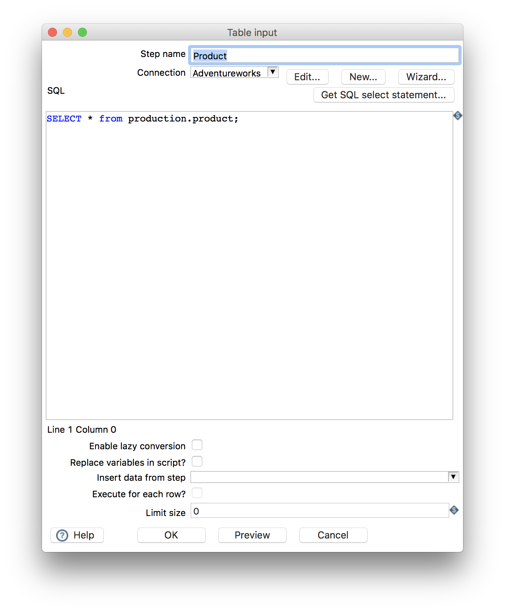
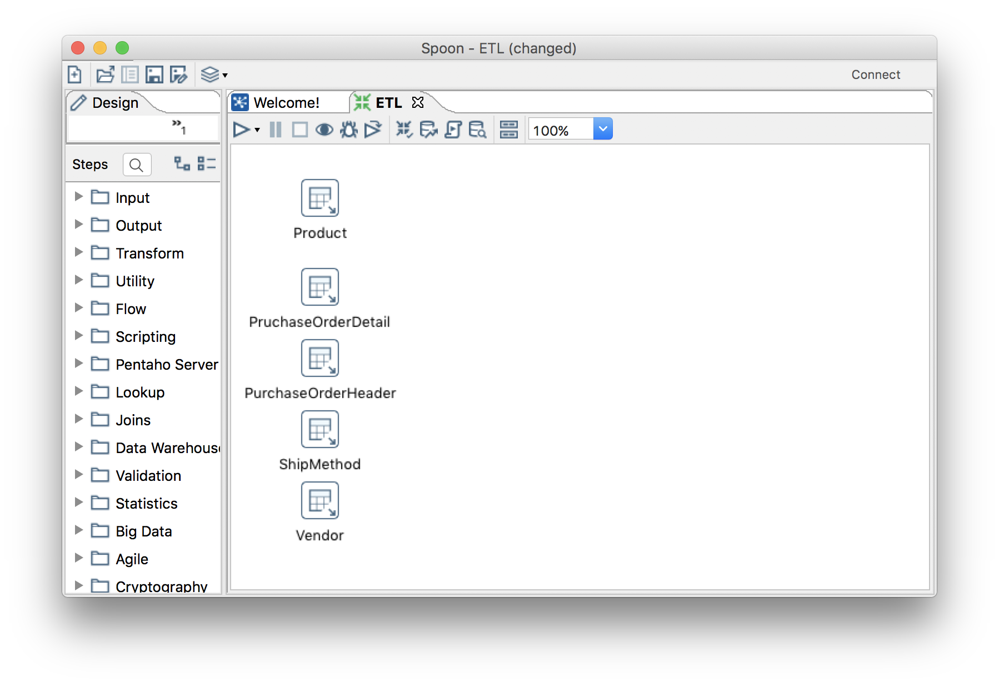
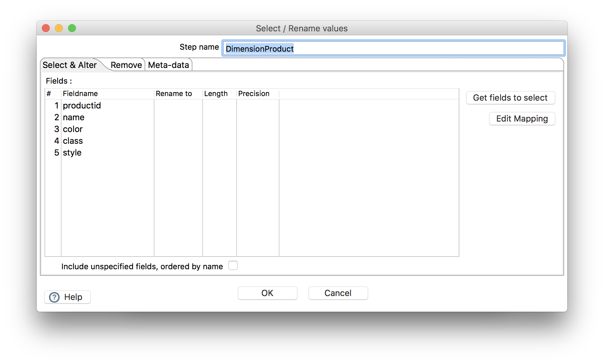
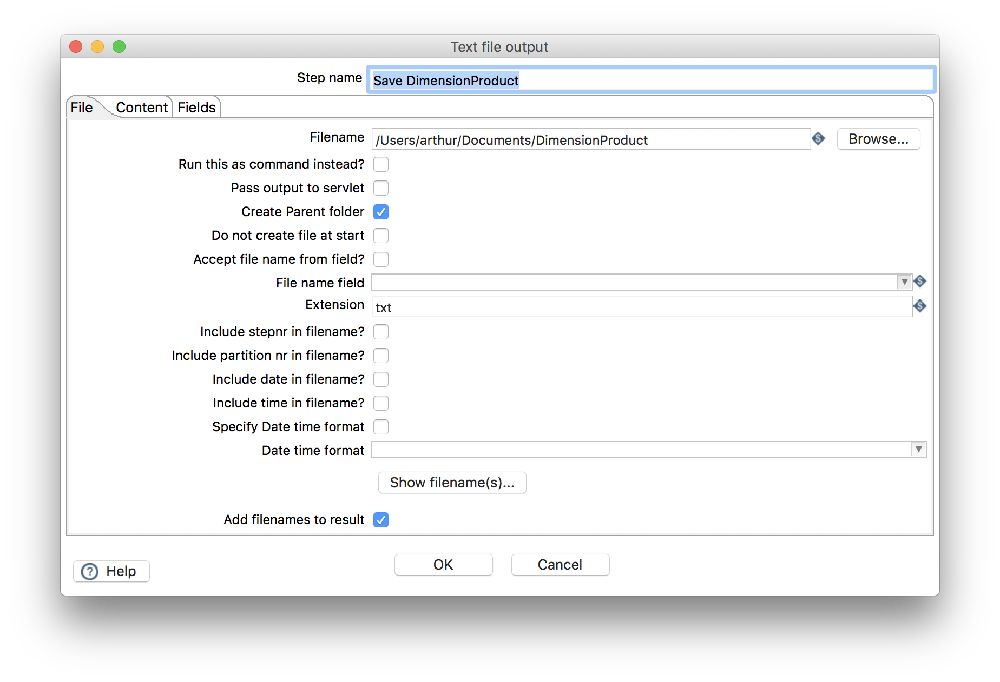
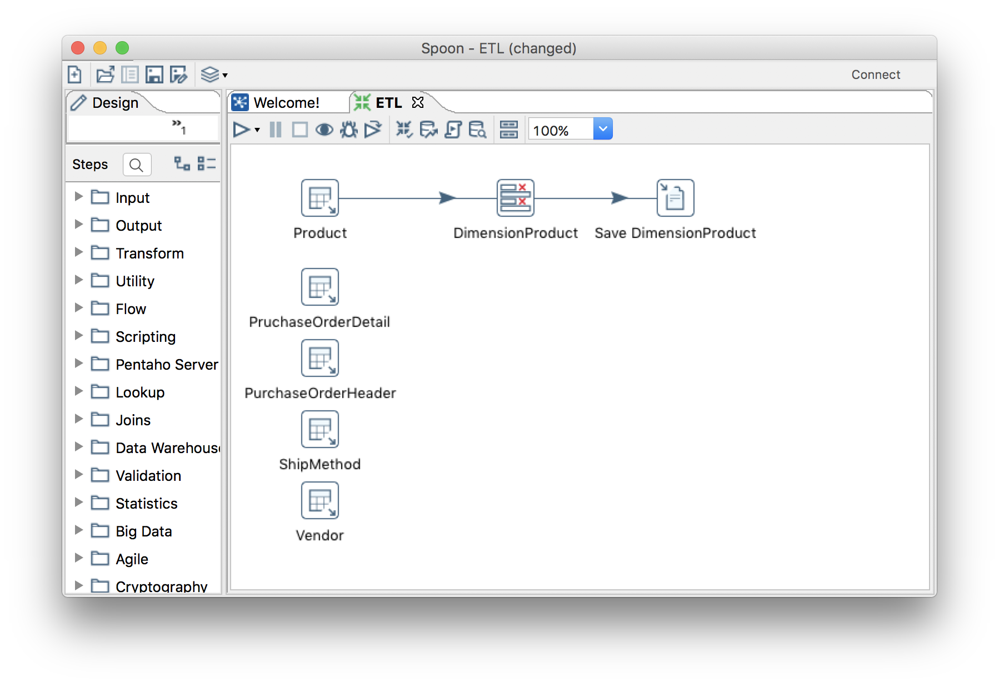
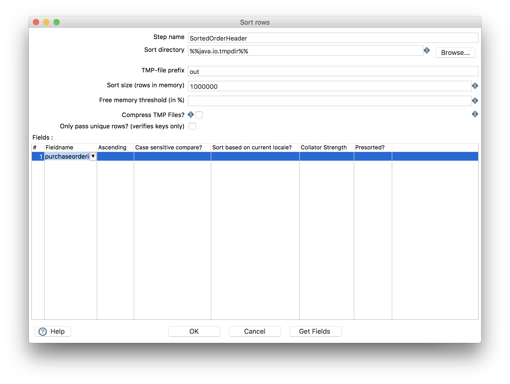
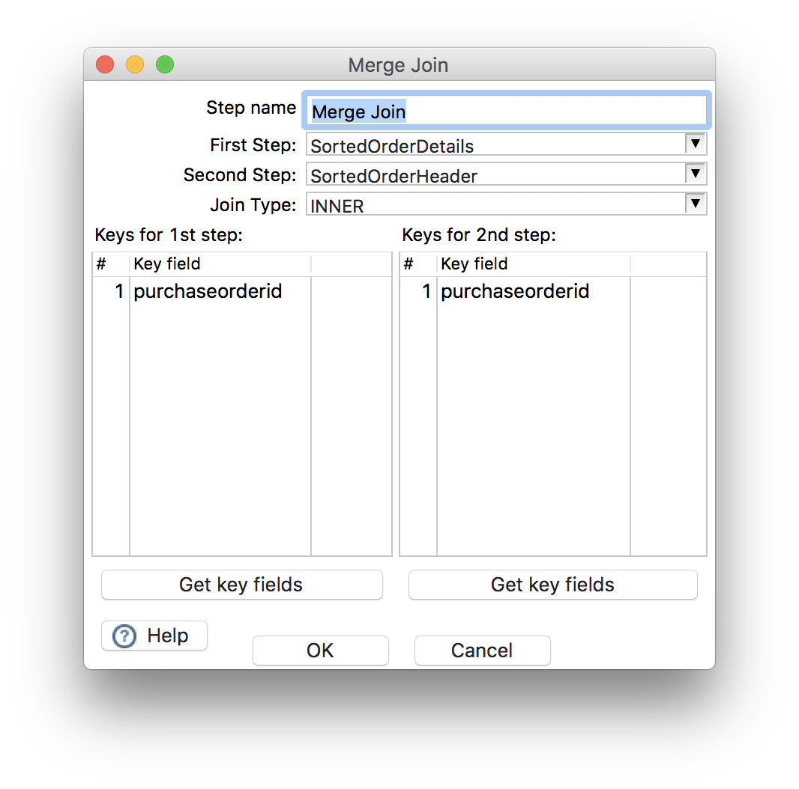
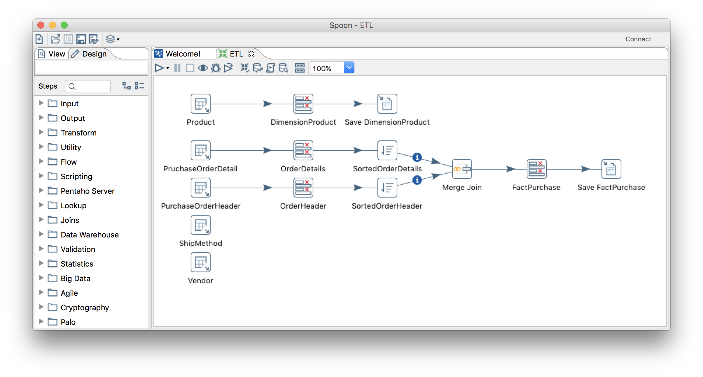

# ETL

## Lab

This lab will allow students to become familiar with an ETL process and related
concepts. Specifically, this lab will cover topics related to extraction and 
transformation and will focus on transforming data stored with a transactional
model into data stored with a dimensional model. Rather than load the data into
a target data store, a set of text files will be created.  These text files will
contain data that could be used to populate the tables of the dimensional model
we previously looked at, pictured below.



### Requirements
- [Pentaho Data Integration(Kettle)](https://community.hds.com/docs/DOC-1009855)
- A connection to a database with the [AdventureWorks data](https://msftdbprodsamples.codeplex.com/releases/view/5921).  Refer to this [ER
diagram](http://cob.jmu.edu/mitrimx/cis484/AdventureworksOLTPERDiagram.jpg) for
the database structure.

### Getting Started

To begin, download the Data Integration zip file from https://community.hds.com/docs/DOC-1009855.
Once downloaded, unzip the file.  To start the program in Windows, double-click
the `Spoon.bat` file.  If the program does not start, open the `Spoon.bat` file 
in notepad, and replace `start javaw` in the last line of the file with `java`.

Once the program has started, click the *New File* icon in the upper left 
corner of the window and select transformation.  

### Loading Data

To begin, we'll load data from several tables in the database. The tables we'll
need to access are:

- production.product
- purchasing.purchaseorderdetail
- purchasing.purchaseorderheader
- purchasing.shipmethod
- purchasing.vendor

To access the data in these tables, we'll use the *Table Input* step in Data
Integration. Expand the *Input* folder in the *Design* pane and drag-and-drop
the *Table Input* step to the right-hand pane.  Double-click the newly created
step to modify its properties.

In order to access the database, we'll have to create a new database connection.
From the *Table Input* step properties window, click *New...*.  This will open 
the *Database Connection* window. Enter the database connection details provided
in class or on Blackboard.  Be sure to test the connection.  If the Data
Integration is able to connect to the database, click *OK* to save the
connection details.

### A Dimension Table

We'll make use of SQL to load table data.  For our first *Table Input* step,
we'll load data from the **production.product** table. Enter the following in
the *SQL* text box:

```sql
Select * from production.product;
``` 

We can preview the data using the *Preview* button. We can also give a
descriptive name to the step, like "Product*. If the preview appeared to be
correct, save the *Table Input* step's properties by clicking "OK".

Normally, we'd only select those columns that we'd plan on using but for
simplicity and to demonstrate other features of the tool, we'll select all the 
columns.  



Create and configure *Table Input* steps for each of the remaining tables. Your
transformation should look similar to the following:



Now, let's think about the data that will be in our fact and dimension tables.
Our fact table will consist of data from the **purchase.purchaseorderdetail**
table; specifically, the **OrderQty** and **LineTotal** columns.  Columns from
the same table will be used in our **DimensionProduct** dimension table. So, as
a first step, we could work on creating that dimension table.  Since all the
data can be extracted from one source table, this should be a relatively simple
task. 

For the dimension table, we'll only need the following columns from the 
**purchase.product** table:

- productid
- name
- color
- class
- style

To select data from only these columns, we'll use a *Select Values* step
available in the *Transform* folder. After dragging-and-dropping the step,
double-click to modify its properties.  Not only can we select specific columns,
we can also rename them, if desired.  Enter the columns above as field names
and click *OK*. If using the drop-down menus to select fields, don't worry if 
some column names don't appear - manually type the full name.



To connect the *Table Input* and *Select Values* steps, hold the SHIFT key and
click-and-drag from the *Table Input* step to the *Select Values* step. When
connecting steps, if you are prompted to choose between the step's main output
or error handling, choose main output.

We're now ready to save the data.  While we might typically save this to a new 
database, we'll save it as a text for this lab.  To do this, drag-and-drop a 
*Text File Output* step from the *Output* folder. Double-click to modify the
step's properties - be sure to set the filename.



Connect the output from the *Select Values* step to the *Text File Output* step.

The transformation should now look similar to this:



To run the transformation, click the play button in the toolbar and click *OK*
in the *Run Options* dialog window. We can save the transformation at this
point. A new text file containing data for the *DimensionProduct* dimension
table should have been created.  

### The Fact Table

Most of the data we'll need for the fact table can be found in an existing
table, **purchasing.purchaseorderdetail**.  Specifically, we can use these
columns:

- shipmethodid
- productid
- orderqty
- linetotal

Notice, however, that we're missing information about order date that we can 
use to create the *DimensionDate* dimension table and a vendor ID.  Let's think
about how we can get these.  We know that the **purchasing.purchaseorderdetail**
table contains a **purchaseorderid** key that appears in the
**purchasing.purchaseorderheader** table as well.  We can can use this
relationship to join data from the two tables. Once the data is joined, we can 
determine the vendor id and order datea associated with a record in the
**purchasing.purchaseorderdetail** table.

To do the join, we'll ultimately, make use of the *Merge Join* step in the 
*Joins* folder.  Before we do that, we'll use a *Select Values* step and a 
*Sort Rows* step on each of the source data sets.  Add *Select Values* steps and
connect them to the *Table Input* steps. Select the following fields from 
**purchasing.purchaseorderheader** table:

- purchaseorderid
- vendorid
- orderdate

Select these columns from the **pruchasing.purchaseorderdetails** table:

- purchaseorderid
- shipmethodid
- productid
- orderqty
- linetotal

Notice that if join the tables on **purchaseorderid** and discard that field, 
we'll be left with something close to the desired fact table.  We'd need to do 
something with the **orderdate** field as well but we won't do that in this lab.

Next, add a *Sort Rows* step after each *Select Values* step and connect one
*Select Values* step to one *Sort Rows Step*. For both these steps, we'll 
specify that rows should be sorted by values in the **purchaseorderid** field.

 

Now that the rows are sorted, we can merge them.  Drag-and-drop a *Merge Join*
step from the *Joins* folder. Connect the two *Sort Rows* steps to the new *Merge Join* step. Your transformation should look similar to this:


Double-click the new *Merge Join* step.  Set the first and second steps to be 
the *Sort Rows* steps that are connected to this step.  Set the key field for 
both steps to **purchaseorderid** and click *OK*. Note the warning about sorting
and click *I understand*. 



We can now use another *Select Rows* step to select these rows from the
*Merge Join* step:

- vendorid
- orderdate
- shipmethodid
- productid
- orderqty
- linetotal

Finally, we can save the output of the *Select Rows* step to a text file using 
as *Text File Output* Step.   



You should now be able to run the transformation without errors and create 
two data files with content.

Save the transformation and submit the file via Blackboard.

## Exercise

Create the necessary *Select Values* and *Text File Output* steps to save the 
data needed for the **DimensionVendor** and **DimensionShipMethod** dimension
tables from the **purchasing.shipmethod** and **purchasing.vendor** tables,
respectively.  Save the transformation and submit the file via Blackboard.

