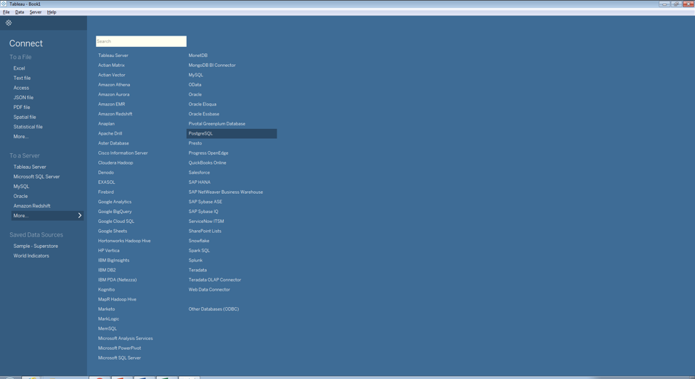
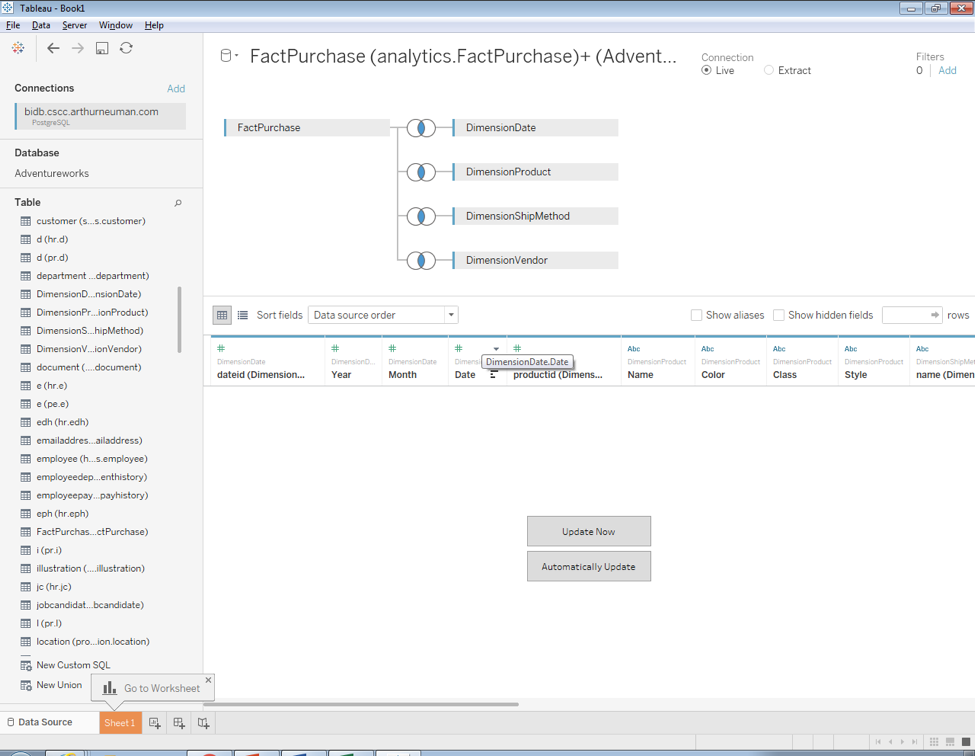
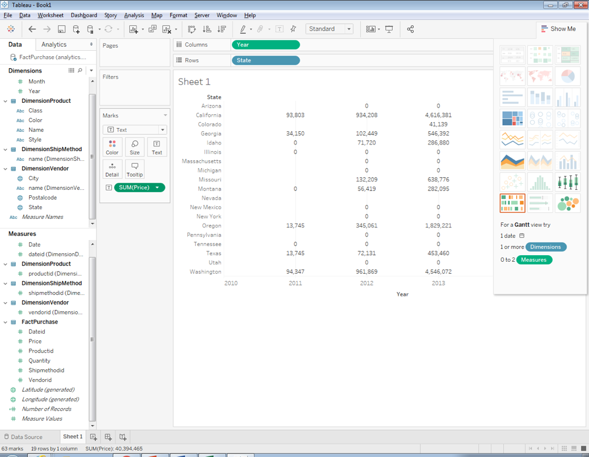
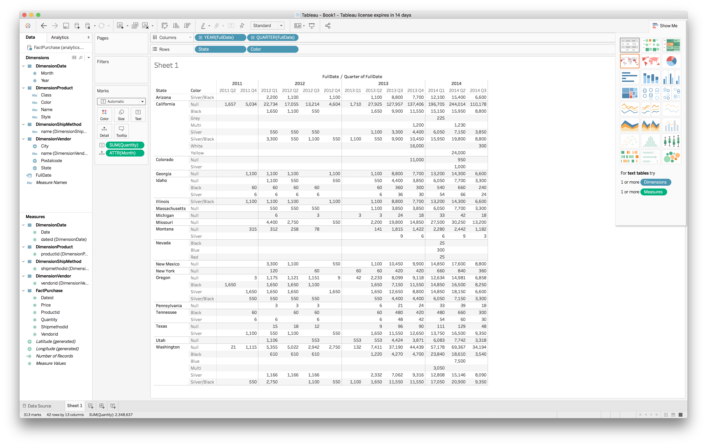

# OLAP

In previous classes, we examined the content of normalized, transactional 
databases, created dimensional models (like the one below) with the 
understanding that such models would make it easier to query data to answer 
questions, and reviewed the process of extracting, transforming, and loading 
data from the source data warehouse into the dimensional model.  


Now that we have the data stored in a dimensional structure, we can begin to 
perform son analysis.  In this lab and exercise, we'll make use of a tool 
to perform online analytial processing (OLAP).  The tool, 
[Tableau](hhttps://www.tableau.com/), can be downloaded and installed on a 
computer for this lab.  Normally, Tableau is used for data visualization, 
but we'll use it to extract data from our dimensional model. 

## Lab
To begin, download Tableau from the link above by clicking *Try Now*; enter your
email address and click *Download Free Trial*.  Once downloaded, run the 
install program.  Once the installation complete, register for a trial by 
entering your information in the registration window. 

Once Tableau loads, we'll begin by specifying the data source.  Select *More* 
from the *To a Server* section then select *PostgreSQL*.  



You'll now be prompted for database connection information - see Blackboard 
for details.  Once connected, we'll have to specify which tables we'd like to 
use.  For our work, we'll use the following fact and dimension tables:

- FactPurchase
- DimensionVendor
- DimensionProduct
- DimensionShippingMethod
- DiminensionDate

To select these tables, draw them from the left into the top area of the
right-hand section of the interface.  Start with the *FactPurchase* table.
Tableau will automatically determine the relationships between the tables.



To begin working with the data, we can start using a worksheet; click *Sheet1*
near the bottom of the interface.  

We can now drag attributes and measures from the left-hand side of the interface
to the *Row*, *Column*, and "Marks" sections on the right hand side.  

Notice that Tableau tried to automatically determine which fields were 
dimensional attributes and which were measures - it didn't get everything right 
but for this lab that's okay.  When we work with Tableau for visualization, 
we'll correct things like this.  

For this lab, let's try to see the total purchase price of all products by year 
and by state.  To begin, drag the *Year* dimensional attribute to the
*Columns* section.  Next, drag *State* to the *Rows* section.  You should now
see years listed as column labels and states listed as row labels.  To add data,
drag the *Price* measure to the *Marks* area.  By default, Tableau tries to 
display a visualization of the data.  We're interested in the numeric values.
To see the numeric data, click the icon to the left of *Sum(Price)* in the 
*Marks* section and select the icon with a *T* in a box. Next, select *Text* 
from the drop-down at the top of the *Marks* section.  You should now see 
numeric values.  Alternatively, click *Show Me* in the top right corner and 
select the option in the top-left corner - this will rearrange the columns and 
rows and will require that you correct them.



We can save this as a PDF by selecting *File* and *Print to PDF* from the
menus.  Select the default options and save the file.  Submit this PDF for the
lab on Blackboard.

We can add additional attributes to our list of rows to see a more-detailed
break-down of the data.  Drag the *Color* attribute to the right of *State* 
in the *Rows* column.  Now we should see color details for each state.

When we created our dimensional model, we chose to separate the year, month, 
and date parts from the order date.  Some analytics tools easily allow us 
to specify these fields in a hierarchy to enable drill-down/drill-up 
functionality.  In Tableau, we can achieve this with a field that contains the 
entire date so we'll have to combine these values.

Return to the *Data Source* interface by clicking *Data Source* in the lower 
left corner.  First, indicate that the *Year*, *Month* and *Date* fields contain
numeric data by clicking the icon above each and selecting *Number(whole)*. 
Next, right-click in the area next to the *Year" column in the lower
pane of the right section of the screen and select *Create Calculated Field*.
We'll use string concatenation to recombine the date parts.  Enter the following 
for the calculation, name the new field "FullDate", and click *OK*

```
str([Year]) + "/" + str([Month]) + "/" + str([Date])
```

Next indicate that the new field is a date by click *Abc* near the top of the 
field and selecting *Date*.  Return to the work sheet.  Remove the *Year* 
field from the list of columns and replace it with *FullDate*.  To drill-down
on date, click the *+* icon next to *YEAR(FullDate)* - this will drill-down
to quarters. 



## Exercise
Create a table that displays the total number of products purchased for each 
year, broken down by vendor state and product style.  Save the table as a PDF 
and submit on blackboard.