# Mathematical Models

In this lab we'll explore two specific type of mathematical models: linear and
logistic regressions.  This lab will make use of Microsoft Excel but similar
software can be used as well.

In this lab, we'll be working with the Pima Indians Diabetes dataset availble 
on [Kaggle](https://www.kaggle.com/uciml/pima-indians-diabetes-database) with 
a backup copy availalbe [here](data/diabetes.csv).  The data collected in this 
dataset represent female patients at least 21 years old.

## Part 1: Linear Regression
Once you've downloaded the file, open it in Excel.  Notice, that there are 
several columns and hundreds of rows of data.  The columns are:

- Pregnancies: Number of times pregnant
- Glucose: Plasma glucose concentration after 2 hours in an oral glucose 
tolerance test
- BloodPressure: Diastolic blood pressure (mm Hg)
- SkinThickness: Triceps skin fold thickness (mm)
- Insulin: 2-Hour serum insulin (mu U/ml)
- BMI: Body mass index (weight in kg/(height in m)^2)
- DiabetesPedigreeFunction: Diabetes pedigree function
- Age: Age (years)
- Outcome: Class variable, 0 or 1, representing whether the patient was/was not 
diagnosed with diabetes.

We'll use linear regression to determine if there is a relationship between two 
of these columns, the strength of the relationship based on how well the 
regression fits the data, and try to make predictions using the regression.

We can begin by thinking about each of the columns and how they might be 
related. Suppose we want to determine if there is some relationship between BMI 
and blood pressure.  A good first step is too examine a scatter plot of the data
with values one one axis representing BMI and values on the other axis 
representing blood pressure.  To do this, select the entire *BloodPressure* 
column then the entire *BMI* column.  Next, choose *X Y (Scatter)* and *Scatter*
from the *Insert* ribbon.

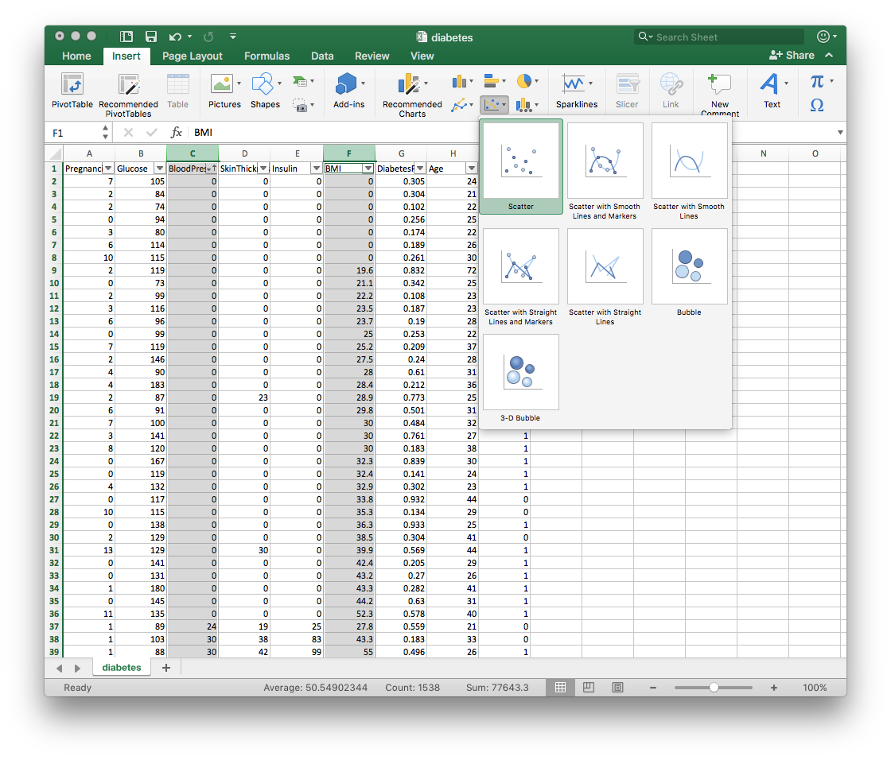

A new scatter plot will be created in the current sheet.  The plot that is 
generated has blood pressure on the x-axis and BMI on the y-axis.  For our 
analysis, let's assume that BMI is the independent variable and blood pressure 
is the dependent variable. In other words, blood pressure varies based on 
BMI.  In this context, we should switch the axes.  To do this, right-click 
on the plot, and select *Select Data...*.  Switch the values specified for 
*X values* and *Y values*. You can also update the *Name* field.

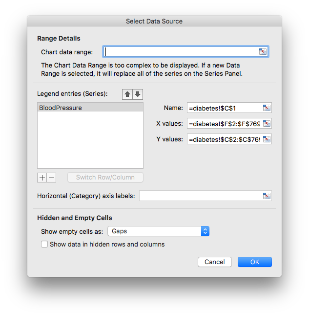

The scatter plot should look simiar to the following:


There are two things we can notice from the plot.  First, there are several 
rows of data where either BMI or blood pressure are 0.  It seems unlikely that 
these represent actual measured values but indicate that data was missing. 
Second, the shape of the data seems to indicate that blood pressure increases as
BMI increases.  We can confirm this relationship using a linear regression.

Before we calculate the regression, let's remove the rows with 0 for BMI or 
blood pressure.  One way to do this is to sort the data first by the
*BloodPressure* column then by the *BMI* column, removing 0 rows after each 
sort.  

To sort the data, select *Sort* from the *Data* ribbon and specify the
*BloodPressure* column.  Select all the rows with 0 for *BloodPressure* and 
delete them.  The scatter plot may disappear in the process - it was been 
resized and can be manually resized as necessary. 
Repeat the process for the BMI column.  After removing theses rows, you should 
be left with 729 rows of data (excluding the header row).

We're now ready to calculate the linear regression.  To do this, we'll use 
the *Data Analysis* add-in.  To enable it, choose *File* and *Options* from
the menus.  Select *Add-ins* and click the *Go...* button near the bottom of the
dialog box.  Select *Analysis Toolpack* and *Solver Add-in* and click *OK*. 

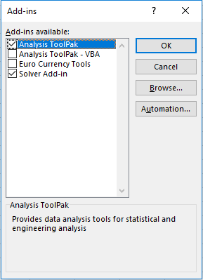

Now, from the *Data* ribbon, click *Data Analysis*. Select *Regression* and 
click *OK*.  In the *Regression* dialog, we can specify the range of values 
to use for the *Y* or dependent variable and the values for the *X* or
independent variable.  Choose the *BloodPressure* column for the *Input Y Range*
and the *BMI* column for *Input X Range*.  Make sure *Labels* is selected since
our spreadsheet includes a header row.  We can also specify where the output 
should be stored; select *New Worksheet Ply* and specify name for the new 
worksheet.  Additionally, select *Line Fit Plots* from the 
*Residuals* section.  Click *OK* to calculate the regression.

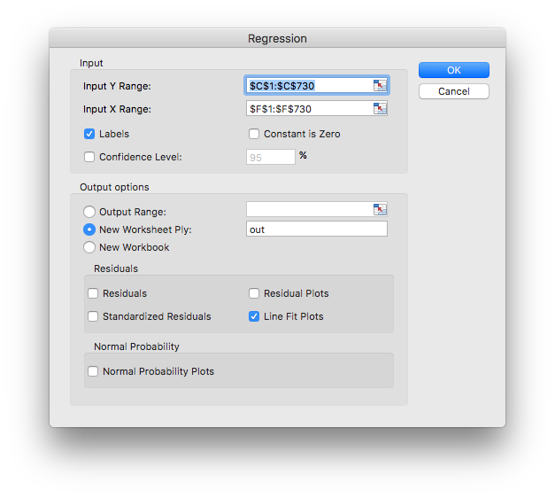

A new worksheet will be created with data related to the regression. You can
resize the plot to view it better as needed. 

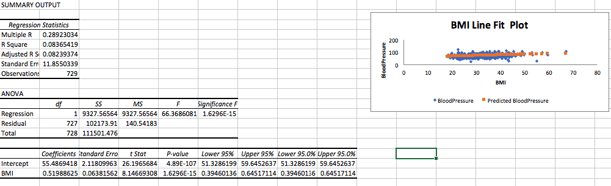

Key pieces of data to note are the following:

|          Name           | Value |
| ----------------------- | ----- |
| Coefficient - Intercept | 55.49 |
| Coefficient - BMI       | 0.52  |
| R Square                | 0.08  |

We can use the coefficients to construct the linear equation that relates 
BMI and blood pressure:

```
Blood Pressure = 0.52 * BMI + 55.49
```

We can predict, for example, what a person's blood pressure might be if their 
BMI is 30:

```
Blood Pressure = 0.52 * BMI + 55.49
               = 0.52 * 30 + 55.49
               = 15.6 + 55.49
               = 71.09
```

The other key piece of data, R square or the coefficient of determination,
indicates how well the regression line fits the data. The coefficient of 
determination can range in values from 0 to 1 with 1 indicating that the 
regression fits the data and 0 indicating that the regression is no better than
the mean value of all the data (approximately 72.4 in this case).

It's important to note that no matter how well a linear regression fits
the data it does not prove causation - that a change in one value causes a 
change in another - it only helps to establish that the two have a linear 
relationship.  What, if anything, can we say about the relationship between
blood pressure and BMI?

Save your Excel workbook.  Be sure to select *File* and *Save As* from the 
menus and to choose *Excel Workbook (.xlsx) as the file format.

## Part 2: Logistic Regression
For this part of the lab, we'll try to determine the likelihood of being 
diagnosed with diabetes given a certain value glucose concentration. In our 
data, *Outcome* is a categorical value so it makes sense to use a logistic
regression.

To begin, start with the worksheet that contains the data we downloaded and 
clear anything that you might have added to the right of the data including 
any plots. Next, sort the data by *Glucose* and remove any rows with zero 
values.    

Unfortunately, Excel does not have a built-in tool to calculate logistic 
regressions; it does, however, have tools we can use to calculate the logistic 
regression if we do a bit work upfront.  

A logistic regression will have the following form:

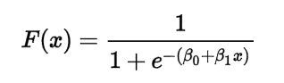

Where *F(x)* represents the dependent variable, *x* is the independent variable 
and *B<sub>0</sub>* and *B<sub>1</sub>* are coefficients determined by the data,
similar to the slope and intercept of a line determined using a linear 
regression.  The *B<sub>0</sub> + B<sub>0</sub>x* part of the formula is 
known as the *logit* and as a first step, we will calculate this value for each
glucose data value with some initial guess for the coefficients.

To begin, insert two rows at the top of the worksheet - this will help us 
keep things organized.  At some place in the new rows, enter `b0` and `b1`, each
on its own line and values of `0.1` in the cells next to each - these are our 
initial guesses. Next, add a formula to calculate the logit for the first 
row of data and fill down.  Make sure you use absolute cell references with 
the coefficient values so the reference doesn't change as you fill down.

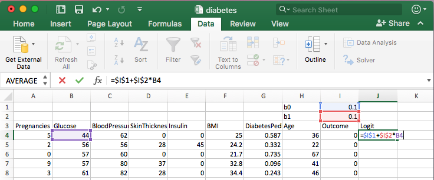  

Next, we will calculate *e<sup>L</sup>* for each row where *e* is the base 
of the natural logarithm (approximately 2.718) and *L* is the logit we just 
calculated.  Use the `=exp()` formula in Excel and fill down. 

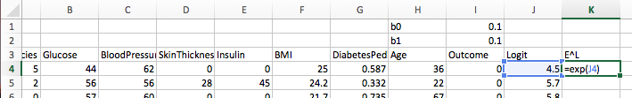 

Next we calculate the probability, P(x), of each event using 
*e<sup>L</sup>/(1+e<sup>L</sup>)* for each row.

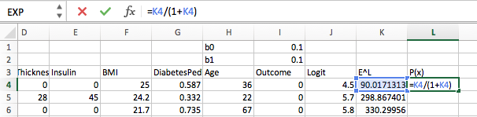

Next, we'll calculate the value of the log-likelihood function. To start,
calculate the following for each row:

```
y*ln(P(x)) + (1-y) * ln(1-P(x))
```

where *y* is the value of the dependent variable for each row and 
*ln()* is the natural logarithm.  

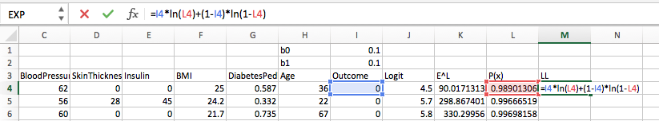

We can store the sum of these newly calculated values above the header row.

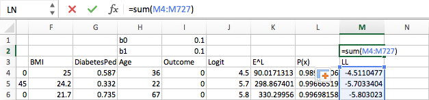

This is the value of the log-likelihood function given our data and the chosen
values of the coefficients.

We will now use Excel's solver to try to find values for the coefficients that 
will result in a maximum value for the log-likely.  Choose *Solver* from the 
*Data* ribbon.

In the *Solver Parameters* dialog, set the objective to the cell containing the
value of the sum we just calculated - the log-likelihood function.  For the 
constraints, specify the cells containing the coefficient values.

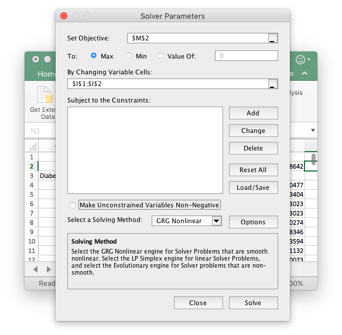

After clicking *Solve*, you should see another dialog that indicates that the 
solver has found a solution; click *OK*.  At this point its important to note 
that there might be different "solutions" where some are better than others and 
there are ways to find these better solutions.

With the newly calculated coefficient values, we can now calculate the 
probability of a patient being diagnosed with diabetes given a certain value 
for *Glucose*.  Examining the data, we can see that the *Glucose* column has 
values that range from 44 to 199.  We can create a column of all values from 
44 to 199. In the column next to the new column, we can calculate the logit,
*e<sup>L</sup>*,  and the probability for each value.

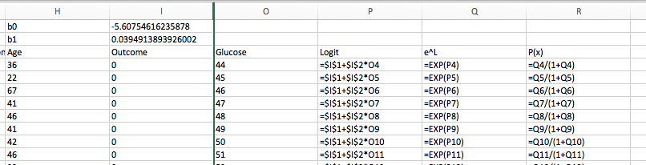

With this data, we can now see the likelihood of a diabetes diagnoses given 
a certain glucose value.  

To plot these values, select the column with the newly created glucose values
and the column with the corresponding probabilities.  Select a line chart 
from the *Insert* ribbon.  With some corrections to the axes ranges, you 
should have something similar to the following:

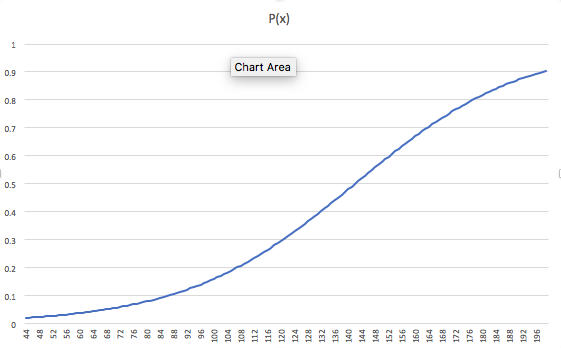

Just as with linear regressions, we must be careful not to misinterpret the 
results as implying causation between measured glucose and the probability of a 
diabetes diagnoses.  There are also methods of evaluating how well the 
regression fits the data.

## Exercise
Calculate the coefficients for a linear regression relating glucose and insulin
measurements. Does the regression indicate that a change in glucose levels 
causes a change in insulin levels or vice versa? Save and submit the workbook 
with the output worksheet. 